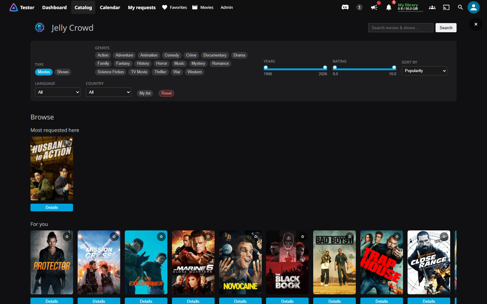
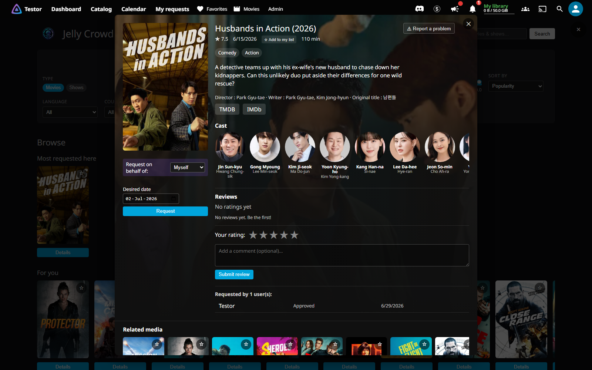
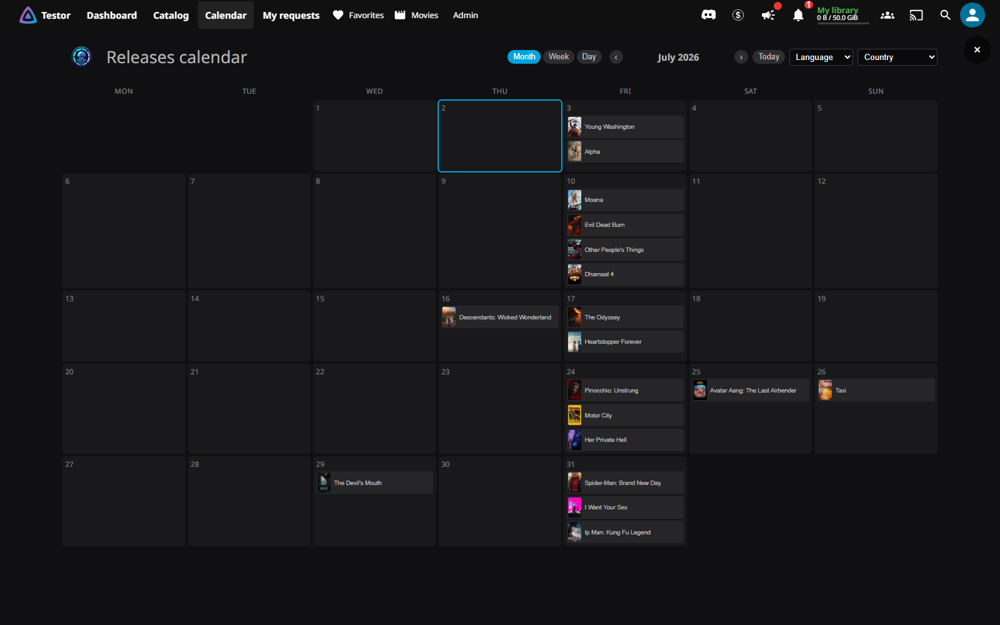
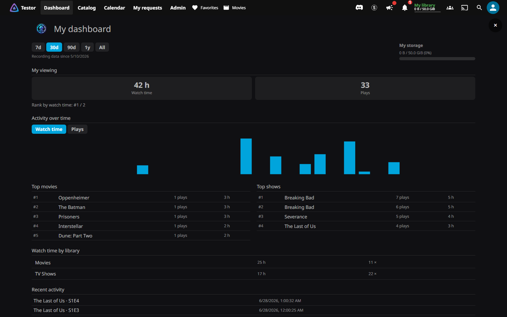
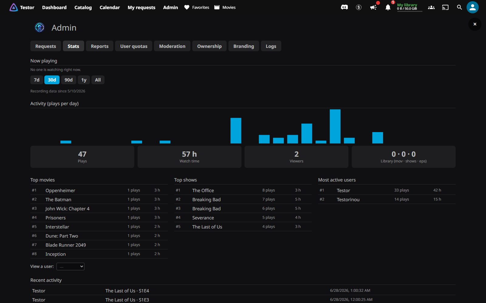
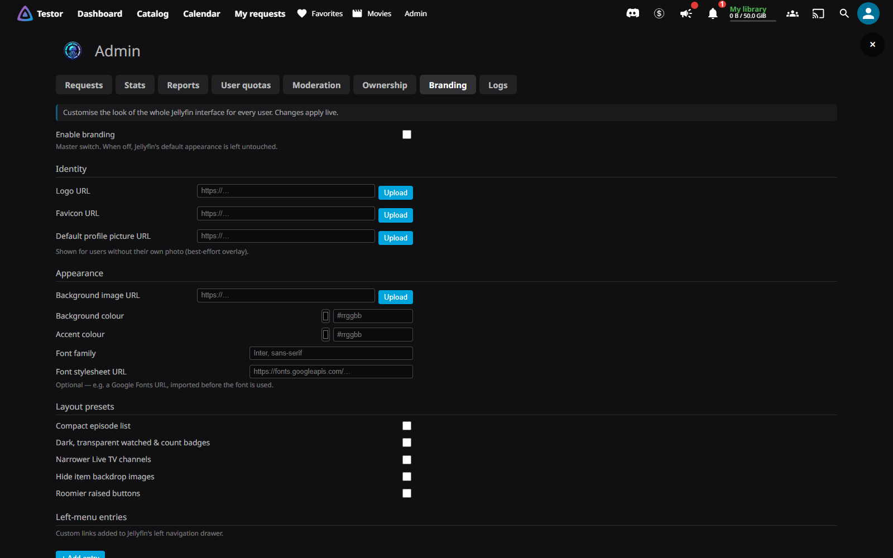

<div align="center">


# Jelly Crowd

### ⚡ One plugin to rule them all

A complete **media request & discovery platform** for Jellyfin — catalog, requests, quotas,
notifications, full UI branding and built-in stats — all in one plugin, **no add-ons required**.

[](https://jellyfin.org)
[](#-requirements)
[](#-installation)
[](./LICENSE)

</div>

---

> [!TIP]
> Think **Overseerr + Tautulli + a theme engine**, fused into your Jellyfin UI — requests, quotas,
> statistics and branding, with nothing else to install.

## 📸 Screenshots

<p align="center"></p>
<p align="center"><sub><b>Discovery catalog</b> — browse, filter and request, right inside Jellyfin</sub></p>

<p align="center"></p>
<p align="center"><sub><b>Title detail</b> — cast, seasons, reviews & one-click requests</sub></p>

<p align="center"></p>
<p align="center"><sub><b>Release calendar</b> — what's coming, and when (month / week / day)</sub></p>

<p align="center"></p>
<p align="center"><sub><b>Personal dashboard</b> — watch time, top titles, activity & storage</sub></p>

<p align="center"></p>
<p align="center"><sub><b>Admin statistics</b> — activity chart, top media, most-active users & live now-playing</sub></p>

<p align="center"></p>
<p align="center"><sub><b>Branding</b> — logo, favicon, colours, font, layout presets & menu links (URL or upload)</sub></p>

## ✨ Features

| Feature | What it does |
|---|---|
| 🎬 **Discovery catalog** | Browse, filter and search a TMDB catalog of movies & shows, with rich detail popups (cast, crew, ratings, TMDB/IMDb links). |
| 📅 **Release calendar** | Upcoming releases in a month / week / day view, filtered by language & country. |
| 📥 **Media requests** | Request whole movies & shows, single seasons or individual episodes — with a desired date for unreleased titles. |
| ✅ **Approval workflow** | Admins approve or deny from a queue; requesters are notified of every status change. |
| ⚙️ **Auto-approval rules** | Optionally auto-approve by estimated size, a genre allow-list, and trusted-user overrides. |
| 🤖 **Radarr / Sonarr fulfilment** | Approved requests are added and searched automatically — movies via Radarr, shows via Sonarr (TVDB resolved for you). |
| 🔗 **Webhook backend** | Prefer your own automation? POST each approved request to a webhook. |
| 📜 **Script backend** | Or run a local script per request, with the details on stdin and as environment variables. |
| 📡 **Live download status** | *My requests* shows real Radarr/Sonarr progress — queued, downloading %/ETA, importing, available. |
| 🗂️ **Manual-import aware** | Drop a file in by hand and Jelly Crowd marks the request available and asks Radarr/Sonarr to import it from disk. |
| ♻️ **Stalled-download recovery** | Detects stuck downloads and re-searches automatically so a request doesn't get stuck. |
| 💾 **Per-user quotas** | A storage budget per user, counted only when media becomes available, at its real size. |
| 📈 **Adaptive quota** | Optionally grow a user's quota as they watch more, with a grace period when they go quiet. |
| ⏳ **Media expiry** | Reclaim space by expiring unwatched media after a configurable window. |
| 👥 **Shared ownership** | When several users request the same title they all own it — and it's removed only once nobody does. |
| ⭐ **Ratings & reviews** | Users rate titles (1–10) and leave reviews, shown anonymously to others (admins see the author). |
| 🛡️ **Review moderation** | Admins can hide, show or delete any community review. |
| 🩹 **Problem reports** | Users flag an issue on a title; admins triage, resolve, and reply back to the reporter. |
| 🔔 **Notifications** | Discord, email, Telegram, ntfy, Gotify, Pushover, Slack or a webhook — choose which events go where. |
| 🎨 **UI branding** | Restyle the whole Jellyfin UI: logo, favicon, colours, font, background, custom CSS, layout presets and custom left-menu links. |
| 📊 **Admin statistics** | Playback analytics — top media & users, a plays / watch-time activity chart, and live *Now playing*. |
| 🙋 **Personal dashboard** | Every user gets their own watch time, top titles, activity chart, watch-time-by-library and storage. |
| 🔒 **Access control** | Hide the plugin while you set it up (*config mode*), with a per-user override to enable or block individuals. |
| 📓 **Activity log** | A bounded, searchable log of admin, user and system events. |
| ⏭️ **Skip Intro** | Fingerprints each season's episodes (bundled ffmpeg audio fingerprinting) to find the shared intro and drives Jellyfin's **native** Skip Intro button. Runs as a scheduled task; episodes with no shared intro (a premiere, a recap) are left alone. Opt-in. |
| ⏭️ **Skip Outro** | Detects end credits on movies & episodes (ffmpeg brightness & silence analysis) and drives Jellyfin's **native** Skip Outro button. Stops at a post-credits bonus scene instead of skipping it. Opt-in. |
| 🎬 **Local intros** | Plays a pre-roll video before movies and the first episode of a series, via Jellyfin's Cinema Mode. Drop videos in a named folder beside your libraries; the plugin finds and indexes it automatically. On the web client it can be made non-skippable with hidden controls. Opt-in. |
| 🩺 **Diagnostics & backup** | Connectivity checks (TMDB, Radarr/Sonarr, indexers) and a one-click configuration backup. |

> [!NOTE]
> Everything is hosted by Jelly Crowd inside the Jellyfin web client — **no third-party plugin** is required.

## 📦 Requirements

- **Jellyfin 10.11+**
- A free **TMDB API key** (for the catalog)
- No other plugin

## 🚀 Installation

1. In Jellyfin: **Dashboard → Plugins → Repositories → Add**, and paste:

   ```text
   https://raw.githubusercontent.com/LokLakh-s/JellyCrowd/main/manifest.json
   ```

2. **Dashboard → Plugins → Catalog** → **Jelly Crowd** → **Install** → restart Jellyfin.
3. Open **Dashboard → Plugins → Jelly Crowd** and paste your **TMDB API key**.

> [!IMPORTANT]
> Updates are automatic — new versions appear in the catalog (or install themselves if auto-updates are on).

## 🛠️ Admin guide

<details>
<summary><b>Click to expand the admin guide</b></summary>

Configure the technical settings in **Dashboard → Plugins → Jelly Crowd**, and manage day-to-day from the
**Admin** entry in the navbar (admin only).

**Dashboard config page**
- **Settings** — TMDB key; default quota; approval mode (manual / auto, with size & genre rules); request
  rate limits; media-expiry window; adaptive quota; UI language; reviews on/off; stats capture on/off.
- **Notifications** — enable & configure each channel and pick which events go where; send test messages.
- **Download** — fulfilment backend (none / Radarr+Sonarr / webhook / script) and its settings, plus
  stalled-download recovery.
- **Diagnostics** — connectivity checks and a configuration backup.

**Admin overlay (navbar → Admin)**
- **Requests** — approve / deny / retry / edit / delete, with live download status.
- **Stats** — totals, top media & users, activity chart, live *Now playing*, per-user drill-down.
- **Reports** — user problem reports.
- **Quotas** — per-user quota & policy overrides.
- **Moderation** — hide/show/delete community reviews.
- **Ownership** — who owns which media.
- **Branding** — customise the whole UI (images accept a URL **or** an upload).
- **Logs** — the plugin activity log.

</details>

## 👤 User guide

<details>
<summary><b>Click to expand the user guide</b></summary>

Jelly Crowd adds navbar entries: **Catalog**, **Calendar**, **My requests**, **Dashboard**.

- **Catalog** — browse/search and **request** titles (whole show, season, or single episodes).
- **Calendar** — upcoming releases of movies & shows.
- **My requests** — track statuses (pending → in progress → available); cancel pending ones; the
  **release date** is shown for unreleased titles.
- **My media** — what you own; request deletion to free your quota, or renew to keep it.
- **Dashboard** — your watch time, top watched, recent activity, request summary and storage usage.
- **Reviews** — rate & review titles (1–10), shown anonymously to others.

A **storage quota bar** in the header shows how much space you've used.

</details>

## 📜 License

Jelly Crowd is **proprietary software** — see [`LICENSE`](./LICENSE). You may install and run official
released builds as a Jellyfin plugin; no other rights are granted.
